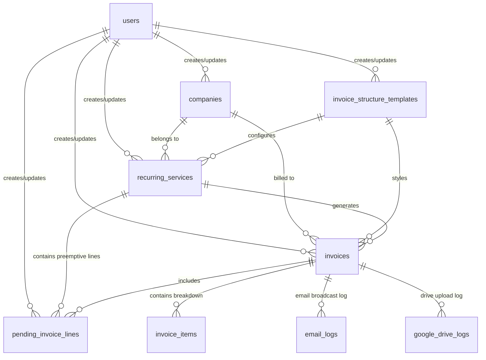

# QueueBill - Repository Structure & Architecture

This document describes the architectural layout, database schemas, traits, and file paths for **QueueBill** ("Your Recurring Revenue, Perfectly Aligned").

---

## 🏗️ Repository Architecture Map

```
QueueBill/
├── app/
│   ├── Console/
│   │   └── Commands/
│   │       └── ProcessAutomatedInvoicesCommand.php   <-- automated billing engine
│   ├── Http/
│   │   └── Controllers/
│   │       ├── Auth/
│   │       │   ├── LoginController.php               <-- admin authentication
│   │       │   └── RegisterController.php
│   │       ├── CompanyController.php                 <-- buyer directory CRUD
│   │       ├── HomeController.php                    <-- dashboard statistics
│   │       ├── InvoiceController.php                 <-- ledger & Scenario B revisions
│   │       ├── InvoiceStructureTemplateController.php <-- dynamic slug templates
│   │       └── RecurringServiceController.php        <-- contract parameters CRUD
│   ├── Models/
│   │   ├── Company.php
│   │   ├── EmailLog.php
│   │   ├── GoogleDriveLog.php
│   │   ├── Invoice.php
│   │   ├── InvoiceItem.php
│   │   ├── InvoiceStructureTemplate.php
│   │   ├── PendingInvoiceLine.php
│   │   ├── RecurringService.php
│   │   └── User.php
│   └── Traits/
│       └── HasUserstamps.php                         <-- model saving hooks
├── database/
│   ├── migrations/
│   │   ├── 2026_05_18_000001_create_companies_table.php
│   │   ├── 2026_05_18_000002_create_invoice_structure_templates_table.php
│   │   ├── 2026_05_18_000003_create_recurring_services_table.php
│   │   ├── 2026_05_18_000004_create_invoices_table.php
│   │   ├── 2026_05_18_000005_create_pending_invoice_lines_table.php
│   │   ├── 2026_05_18_000006_create_invoice_items_table.php
│   │   ├── 2026_05_18_000007_create_email_logs_table.php
│   │   └── 2026_05_18_000008_create_google_drive_logs_table.php
│   └── seeders/
│       └── DatabaseSeeder.php                         <-- testing entities & seeders
├── resources/
│   └── views/
│       ├── auth/
│       │   ├── login.blade.php
│       │   └── register.blade.php
│       ├── companies/
│       │   ├── create.blade.php
│       │   ├── edit.blade.php
│       │   ├── index.blade.php
│       │   └── show.blade.php                        <-- client history profile
│       ├── invoices/
│       │   ├── index.blade.php
│       │   └── show.blade.php                        <-- revision panels
│       ├── layouts/
│       │   ├── app.blade.php                         <-- master dashboard layout
│       │   ├── auth.blade.php                        <-- auth layout partition
│       │   └── partials/
│       │       ├── footer.blade.php
│       │       ├── navbar.blade.php
│       │       └── sidebar.blade.php
│       ├── logs/
│       │   └── index.blade.php                       <-- global transactions tracker
│       ├── services/
│       │   ├── create.blade.php
│       │   ├── edit.blade.php
│       │   ├── index.blade.php
│       │   ├── preview_invoice.blade.php             <-- next cycle invoice forecast preview [NEW]
│       │   └── show.blade.php                        <-- Scenario A pending lines
│       ├── settings.blade.php                        <-- currency & account profile dashboard [NEW]
│       └── templates/
│           ├── create.blade.php
│           ├── edit.blade.php
│           ├── index.blade.php
│           └── preview.blade.php                     <-- custom template previews
└── routes/
    ├── console.php                                   <-- daily midnight task schedule
    └── web.php                                       <-- all URL route definitions
```

---

## 🛢️ Entity Relationship Diagram

All model tables incorporate uniform status enums, created/updated timestamps, and administrative userstamps tracking:



### Table Schema Definitions

#### 1. `companies`
- `id` (BigInt, PK)
- `name` (String, required)
- `email` (String, required)
- `phone` (String, nullable)
- `address` (Text, nullable)
- `status` (Enum: `active`, `inactive`)
- Userstamps & Timestamps

#### 2. `invoice_structure_templates`
- `id` (BigInt, PK)
- `title` (String, required)
- `slug` (String, unique, required) - dynamic preview URL slug
- `sender_email` (String, nullable) - custom email dispatch override address
- `status` (Enum: `active`, `inactive`)
- Userstamps & Timestamps

#### 3. `recurring_services`
- `id` (BigInt, PK)
- `company_id` (FK to `companies.id`, cascade)
- `invoice_structure_template_id` (FK to `invoice_structure_templates.id`)
- `name` (String, required)
- `from_date` (Date, required)
- `to_date` (Date, required)
- `recurring_cadence` (Enum: `month`, `6_months`, `year`)
- `base_cost` (Decimal, 15, 2)
- `invoice_includes` (Text, required) - multi-line scope parsed to $0.00 items
- `next_billing_date` (Date, required) - date pointer for midnight runner
- `google_drive_path` (String, nullable) - target directory path on Drive
- `status` (Enum: `active`, `inactive`)
- Userstamps & Timestamps

#### 4. `pending_invoice_lines` (Scenario A Queue)
- `id` (BigInt, PK)
- `recurring_service_id` (FK to `recurring_services.id`, cascade)
- `description` (String, required)
- `amount` (Decimal, 15, 2)
- `billing_status` (Enum: `pending`, `invoiced`)
- `invoice_id` (FK to `invoices.id`, nullable)
- `status` (Enum: `active`, `inactive`)
- Userstamps & Timestamps

#### 5. `invoices`
- `id` (BigInt, PK)
- `invoice_number` (String, unique, required) - e.g. `QB-YYYYMMDD-XXXX`
- `company_id` (FK to `companies.id`)
- `invoice_structure_template_id` (FK to `invoice_structure_templates.id`)
- `recurring_service_id` (FK to `recurring_services.id`)
- `period_from` (Date, required)
- `period_to` (Date, required)
- `issue_date` (Date, required)
- `due_date` (Date, required)
- `subtotal` (Decimal, 15, 2)
- `total` (Decimal, 15, 2)
- `version` (Integer, default 1) - increments on retroactive revision
- `google_drive_path` (String, nullable) - synced target path
- `uploaded_to_drive_at` (Timestamp, nullable) - sync timestamp
- `status` (Enum: `active`, `inactive`)
- Userstamps & Timestamps

#### 6. `invoice_items`
- `id` (BigInt, PK)
- `invoice_id` (FK to `invoices.id`, cascade)
- `description` (String, required)
- `amount` (Decimal, 15, 2)
- `is_adhoc` (Boolean) - flags if item is standard scope or injected
- `status` (Enum: `active`, `inactive`)
- Userstamps & Timestamps

#### 7. `email_logs`
- `id` (BigInt, PK)
- `invoice_id` (FK to `invoices.id`)
- `sender` (String)
- `recipient` (String)
- `subject` (String)
- `body` (Text)
- `version` (Integer)
- `created_at` (Timestamp)

#### 8. `google_drive_logs`
- `id` (BigInt, PK)
- `invoice_id` (FK to `invoices.id`)
- `google_drive_path` (String)
- `version` (Integer)
- `status` (Enum: `SUCCESS`, `FAILED`)
- `created_at` (Timestamp)

---

## ⚡ Global Userstamp Trait Design

Models use the trait `App\Traits\HasUserstamps` which dynamically subscribes to Eloquent's `creating` and `updating` lifecycle hooks. When the application writes database changes, it fetches `Auth::id()` and stamps the respective columns, eliminating boilerplate code.
